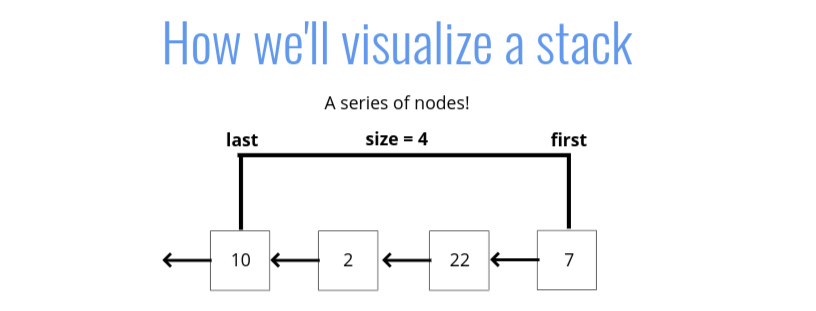

Stacks

Objectives

1. Define what a stack is
2. Understand use cases for a stack
3. Implement operations on a stack data structure

What is a stack?

A LIFO data structure!
(Last in First out)

The last element added to the stack will be the first element removed from the stack



How is it used?

Think about a stack of plates, or a stack of markers, or a stack of ...anything.
As you pile it up the last thing (or the topmost thing) is what gets removed first

The best example for this is
The Call Stack!

Where stacks are used

- Managing function invocations
- Undo / Redo
- Routing (the history object) s treated like a stack!

An important way of implementing stack is Array Implementation

THere is more than one way of implementing a stack

Linked List Implementation

Pushing pseudocode

1. The function should accept a value
2. Create a new node with that value
3. If there are no nodes in the stack, set the first and last property to be the newly created node
4. If there is at least one node, create a variable that stores the current first property on the stack
5. Reset the first property to be the newly created node
6. Set the next property on the node to be the previously created variable
7. Increment the size of the stack by 1

Pop Pseudocode

1. If there are no nodes in the stack, return null
2. Create a temporary variable to store the first property on the stack
3. If there is only 1 node, set the first and last property to be null
4. If there is more than one node, set the first property to be the next property on the current first
5. Decrement the size by 1
6. Return the value of the node removed

```javascript
class Node {
  constructor(value) {
    this.value = value;
    this.next = null;
  }
}

class Stack {
  constructor() {
    this.first = null;
    this.last = null;
    this.size = 0;
  }
  push(val) {
    var newNode = new Node(val);
    if (!this.first) {
      this.first = newNode;
      this.last = newNode;
    } else {
      var temp = this.first;
      this.first = newNode;
      this.first.next = temp;
    }
    return ++this.size;
  }
  pop() {
    if (!this.first) return null;
    var temp = this.first;
    if (this.first === this.last) {
      this.last = null;
    }
    this.first = this.first.next;
    this.size--;
    return temp.value;
  }
}
```

Big O of Stack

Insertion - o(1)
Removal - o(1)
Searching - o(N)
Access - o(N)

Recap

1. Stacks are a LIFO data structure where the last value in is always the first one out.
2. Stacks are used to handle function invocations (the call stack), for operations like undo/redo, and for routing (remember pages you have visited and go back/forward) and much more!
3. They are not a built in data structure in JavaScript, but are relatively simple to implement
4. Insert and remove are both O(1)

Queues

Objectives

1. Define what a queue is
2. Understand use cases for a queue 3. Impleented operations ona queue data structure

What is a Queue?

A FIFO data structure
(First In First Out)

waiting in line is a good example for queue

How do we use them in programming?

1. Background tasks
2. Uploading resources
3. Printing / Task processing

Building a Queue with an array

```javascript
class Node {
  constructor(value) {
    this.value = value;
    this.next = null;
  }
}

class Queue {
  constructor() {
    this.first = null;
    this.last = null;
    this.size = 0;
  }
  enqueue(val) {
    var newNode = new Node(val);
    if (!this.first) {
      this.first = newNode;
      this.last = newNode;
    } else {
      this.last.next = newNode;
      this.last = newNode;
    }
    return ++this.size;
  }

  dequeue() {
    if (!this.first) return null;

    var temp = this.first;
    if (this.first === this.last) {
      this.last = null;
    }
    this.first = this.first.next;
    this.size--;
    return temp.value;
  }
}
```

Enqueue pseudocode

1. This function accepts some value
2. Create a new node using that value passed to the function
3. If there are no nodes in the queue, set this node to be the first and last pproperty of the queue
4. otherwise, set the next property on the current last to be that nose, and then set the last property of the queue to bte that node.

Dequeue pseudocode

1. If there is no first property, just return null
2. See if the first is the same as the last (check if there is only 1 node). If so, set the first and last to be null
3. If there is more than 1 node, set the first property to be the next property of first
4. Decrement the size by 1

Big O of queue

Insertion - o(1)
Removal - o(1)
Searching - o(N)
Access - o(N)

Recap

- Queues are a FIFO data structure, all elements are first in first out
- Queues are useful for processing tasks and are foundational for more complex data structures
- Insertion and Removal can be done in O(1)
